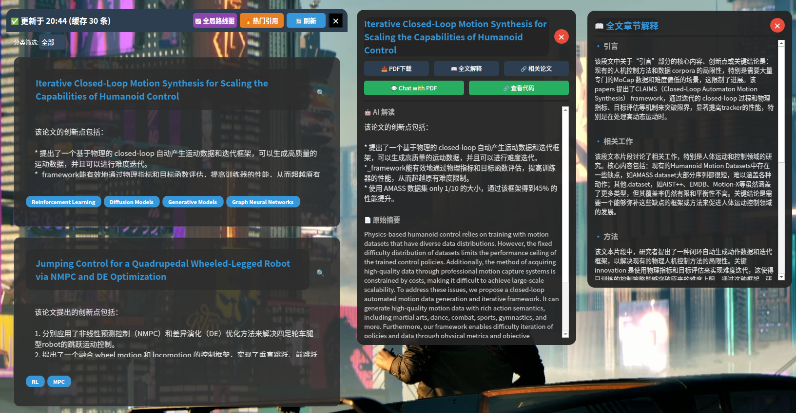

# Arxiv Float: AI 驱动的 arXiv 论文阅读助手

[](https://www.gnu.org/licenses/gpl-3.0)

Arxiv Float 是一款面向机器人/人工智能领域研究者的桌面应用，能够实时获取 arXiv 最新论文，利用大语言模型生成中文摘要，并提供 PDF 聊天、代码仓库查询、全局技术路线图等深度功能，帮助您快速把握领域动态。

## Shot



## ✨ 功能特性

- 📥 **实时论文流** – 自动抓取 `cs.RO` 分类最新论文，支持分类标签筛选。（您可以在源代码修改需要的分类，默认支持Robotics。）
- 🤖 **AI 摘要** – 调用本地 Ollama 服务（默认模型为 `llama3.2`）生成中文创新点简述。
- 🏷️ **智能分类** – 自动为论文打上技术领域标签（RL、VLA、世界模型等）。
- 📄 **PDF 深度交互**  
  - 下载论文 PDF  
  - 全文章节解释（引言、方法、实验等）  
  - 基于检索的 PDF 聊天（支持 BM25 检索）  
  - 分析参考文献，推荐相关论文
- 🔗 **代码仓库集成**  
  - 通过 Papers with Code API 查找代码仓库  
  - 一键打开仓库网页或 Git Clone 到本地
- 📈 **全局技术路线图** – 基于缓存论文生成指定技术领域的发展脉络
- 🔥 **热门引用排行** – 按时间段筛选高引用论文
- 🖥️ **支持后台运行** – 可隐藏至托盘，后台运行

## 🛠️ 安装与运行

### 前置要求

- **Git**
- **Python 3.10+**
- **[Ollama](https://ollama.com/)** – 本地运行大语言模型，并下载`llama3.2`：
```bash
ollama serve
ollama run llama3.2
```

然后终端输入:

```bash
arxiv-float
```

即可运行。

### 从源码运行

注：由于上传限制，源码不包含执行文件，如果想省事请移步Release下载对应软件包。

克隆仓库：
```bash
git clone https://github.com/yourusername/arxiv-float.git
cd arxiv-float
```
安装 Python 依赖：
```bash
pip install -r requirements.txt
```
推荐在虚拟环境中安装。

运行程序：
```bash
python run.py
```

### 使用预构建的 Debian 包（仅限 amd64）

如果您使用的是 Ubuntu/Debian amd64 系统，可以从 Releases 下载 .deb 包，然后安装：
```bash

sudo dpkg -i arxiv-float_*.deb
# 如果提示依赖缺失，运行：
sudo apt --fix-broken install
```
安装后，可以从应用程序菜单启动 Arxiv Float，或直接在终端执行 `arxiv-float`。

## ⚙️ 配置

首次运行后，程序会在您的用户目录下自动创建以下文件夹：

`~/.cache/arxiv-float/` – 缓存文件（论文摘要、标签等）

`~/Documents/arxiv-float-papers/` – 下载的 PDF 存放位置

`~/arxiv-float-clones/` – Git Clone 的代码仓库

您可以通过修改 arxiv_float/utils/constants.py 中的相关常量来调整这些路径。如需更改使用的模型（如 llama3.2），也在此文件中修改 MODEL_NAME。


### 自定义

你可以通过修改`constant.py`来自定义所使用的模型和文章类别：

```python
MODEL_NAME = "llama3.2"
CATEGORY = "cs.RO"
```

你可以修改ollama运行端口来防止冲突：
```python
OLLAMA_HOST = "http://127.0.0.1:11434"
```

分类标签提供了众多预选，您也可以进一步自定义：
```python
CATEGORY_TAGS = [
    "RL", "VLA", "AMP", "IL", "BC", "MPC", "LfD", "RLHF", "Offline RL", "IRL",
    "Imitation Learning", "Reinforcement Learning", "Inverse RL",
    "World Models", "Transformers", "Diffusion Models", "Generative Models",
    "VLM", "Vision-Language Models", "Large Language Models", "Multimodal",
    "Foundation Models", "Embodied AI", "Graph Neural Networks", "Attention",
    "Memory", "Causal Reasoning", "Generative AI",
    "Manipulation", "Locomotion", "Navigation", "Grasping", "Motion Planning",
    "Trajectory Optimization", "Planning", "Control", "Optimal Control",
    "Dynamics", "Sim-to-Real", "Domain Adaptation",
    "Computer Vision", "SLAM", "NLP", "Multi-Agent", "HRI", "Safety",
    "Explainability", "Ethics",
    "Soft Robotics", "Swarm", "Medical Robotics", "Agricultural Robotics",
    "Autonomous Driving", "Drone", "Simulation", "Real-world", "Deployment",
    "Hardware",
    "Meta-Learning", "Few-Shot", "Multi-Task", "Self-Supervised Learning",
    "Supervised Learning", "Unsupervised Learning",
    "Brain-inspired Computing", "Neuromorphic Computing", "Mimic Learning", "Transfer Learning",
    "Other"
]
```

同样地，您可以将缓存目录与下载目录改到您希望的：

```python
# 缓存目录 ~/.cache/arxiv-float/
CACHE_DIR = os.path.join(HOME, ".cache", "arxiv-float")
os.makedirs(CACHE_DIR, exist_ok=True)
CACHE_FILE = os.path.join(CACHE_DIR, "arxiv_float_cache.json")
MAX_CACHE_SIZE = 50

# PDF 保存目录 ~/Documents/arxiv-float-papers/
PDF_SAVE_DIR = os.path.join(HOME, "Documents", "arxiv-float-papers")
os.makedirs(PDF_SAVE_DIR, exist_ok=True)

# 克隆项目目录 ~/arxiv-float-clones/
CLONE_BASE_DIR = os.path.join(HOME, "arxiv-float-clones")
os.makedirs(CLONE_BASE_DIR, exist_ok=True)

```

## 📖 使用指南

启动程序后，主窗口会立即刷新最新论文（默认 30 篇）。

点击论文卡片上的 🔍 放大镜 打开详细窗口。

在详细窗口中：

1. 点击 📥 PDF下载 下载论文。

2. 下载后可使用 📖 全文解释 或 💬 Chat with PDF。

3. 点击 🔗 查看代码 查询代码仓库，支持“打开网页”或“Git Clone”。

主窗口顶部的 🔥 热门引用 可查看近 3 年/1 年/6 个月等时段的高引用论文。

📈 全局路线图 基于已缓存论文生成指定技术领域的发展脉络（需要多篇同类论文）。

## 🤝 贡献

欢迎提交 Issue 和 Pull Request！如果您想添加新功能或改进现有功能，请先开 Issue 讨论。

## 📄 许可证

本项目采用 GNU General Public License v3.0 开源许可证。详情请参阅 LICENSE 文件。

## 🙏 致谢

- [arXiv](https://arxiv.org/) – 学术论文预印本平台
- [Ollama](https://ollama.com/) – 本地大模型运行框架
- [Papers with Code](https://paperswithcode.com/) – 提供代码仓库 API
- [PyMuPDF](https://pymupdf.readthedocs.io/) – PDF 处理库
- [PyQt6](https://riverbankcomputing.com/software/pyqt/) – GUI 框架


